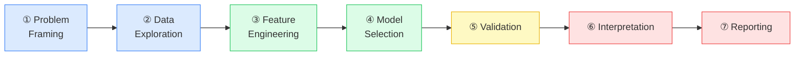
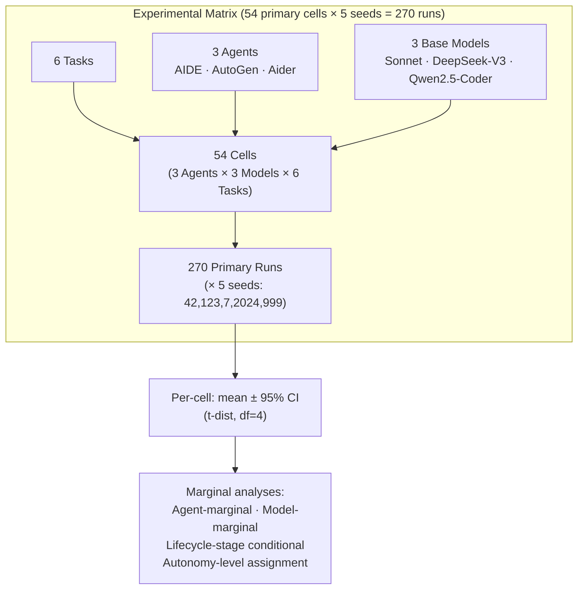
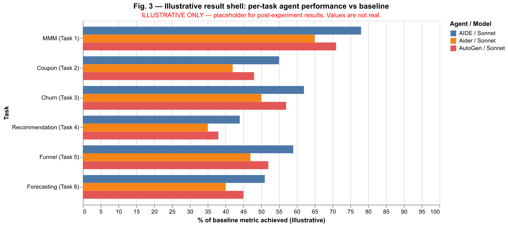
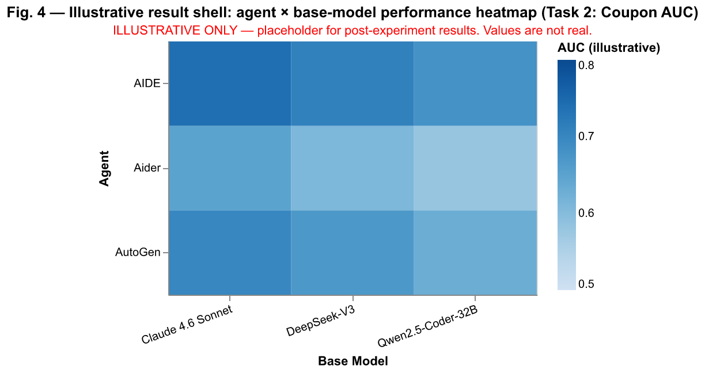

# Agentic AI in Product and Marketing Data Science: A Multi-Agent, Multi-Base-Model Empirical Evaluation Across Six Tasks

**Author.** Aditya Puttaparthi Tirumala — Independent Researcher.

**Date.** 2026-05-09.

**Status.** Pre-experimental registered-report draft (experiments not yet executed; results section is a pre-specified schema pending execution).

> **Author Note on AI assistance.** AutoResearchClaw v0.3.1 (ARC) was attempted as the experimental-harness and paper-skeleton tool; its output did not conform to the locked design spec and was discarded. The present skeleton was drafted by **Feynman v0.2.17** using the paper-writing skill. Results, analysis, interpretation, and discussion will be author-written. Neither ARC nor Feynman is one of the agents under evaluation; neither appears in the experimental matrix. See §4.5 for full tooling disclosure.

> **Pre-registration.** The lifecycle × autonomy framework, task suite, agent matrix, base-model matrix, seed list, evaluation protocols, and hypotheses H1–H2 are to be pre-registered on OSF before any experiments are run. **OSF DOI: [to be filled at upload].**

---

## Abstract

Current benchmarks evaluating agentic AI on data-science (DS) tasks — including MLE-bench, AIRA-MCTS, AutoKaggle, and DSBench — are concentrated on general tabular ML competitions. As of May 2026, no peer-reviewed study evaluates autonomous large-language-model (LLM) agents end-to-end on the tasks that practitioners in **product and marketing data science** routinely face: marketing mix attribution, coupon redemption prediction, customer churn modelling, personalised recommendation, conversion-funnel modelling, and hierarchical retail forecasting. This paper describes the design of, and pre-registers, a study that addresses that gap. We introduce a **Lifecycle × Autonomy framework** — a 7-stage DS lifecycle crossed with a 5-level SAE-inspired autonomy ladder — as a reusable evaluation scaffold. We then specify a 3 × 3 × 6 × 5 experimental matrix (3 agent scaffolds × 3 base models × 6 tasks × 5 random seeds = **270 primary runs**; plus up to 10 optional stretch headline cells bringing the total to ~280) using three philosophically distinct open-source agents (AIDE, AutoGen, Aider) and three model families spanning closed-frontier and open-weights paradigms (Claude 4.6 Sonnet, DeepSeek-V3, Qwen2.5-Coder-32B-Instruct). The MMM task (Task 1) uses a three-tool cross-baseline protocol (Robyn, PyMC-Marketing, LightweightMMM) to guard against single-tool attribution artefacts. Two pre-registered hypotheses guide analysis: (H1) base-model variance exceeds agent-scaffold variance within-task; (H2) agents achieve L4 autonomy on routine prediction tasks but are bounded at L3 on attribution-heavy tasks. All datasets are publicly available; full experimental harness and run logs will be released on GitHub under an MIT licence.

---

## 1. Introduction

The past eighteen months have yielded a surge of agentic AI benchmarks. MLE-bench [Chan et al. 2024] measures whether LLM agents can earn Kaggle medals across 75 machine learning competitions; AIDE [Weco AI 2024], using a tree-search solution strategy, achieves a medal in approximately 17% of competitions at pass@1 and 34% at pass@8 as reported by Chan et al. (2024). AIRA-MCTS, incorporating Monte Carlo Tree Search over the code-editing loop, pushes the medal rate to 47.7% on MLE-bench Lite (as reported in [AIRA-MCTS citation pending verification]). AutoKaggle [Li et al. 2024] and DSBench [Jing et al. 2024] add complementary perspectives on multi-step agentic DS pipelines.

These results are genuinely impressive. Yet they share a structural blind spot: **every existing benchmark is anchored to Kaggle competitions or closely related general-tabular ML tasks.** The Kaggle competition ecosystem favours extreme modelling precision (ensembles, hyperparameter search, feature hacking) on fixed, pre-cleaned datasets — a setting that is structurally unlike the day-to-day work of data scientists in product and marketing organisations, where the primary challenges are causal attribution under confounding, hierarchical forecasting across thousands of SKUs, sparse-interaction recommendation, and mixed-type funnel modelling.

This work fills that gap. Our contributions are:

1. **A Lifecycle × Autonomy framework** for evaluating DS agents — a 7-stage DS lifecycle crossed with a 5-level autonomy taxonomy, pre-registered on OSF before experiments begin. The 7 × 5 matrix is intended as a reusable artifact for subsequent evaluations.
2. **The first multi-agent × multi-base-model empirical evaluation** (to our knowledge, as of May 2026) of agentic AI on a six-task product and marketing DS suite — spanning marketing mix modelling (MMM), coupon redemption, customer churn, personalised recommendation, conversion-funnel modelling, and hierarchical retail forecasting.
3. **Quantitative measurement** of the gap between vendor autonomy claims and observed empirical autonomy levels, using the pre-registered taxonomy.
4. **A fully reproducible experimental harness** with public datasets, version-pinned agents and models, and all run logs released under an MIT licence.

### Research Questions

The study is organised around four research questions:

- **RQ1.** How do agentic AI systems perform across the data-science lifecycle for product and marketing DS tasks, relative to high-effort human baselines (Kaggle leaderboard distributions, published top solutions, established statistical-tool defaults)?
- **RQ2.** Are agent capabilities uniform across base models holding the agent constant, or does base-model choice dominate? Conversely, holding base model constant, does agent-scaffolding choice dominate?
- **RQ3.** Where in the DS lifecycle (problem framing → data exploration → feature engineering → model selection → validation → interpretation → reporting) do agents add value, and where do they actively degrade work quality?
- **RQ4.** How does observed agent performance map to the 5-level autonomy taxonomy? What is the gap between vendor autonomy claims and observed empirical autonomy?

---

## 2. Related Work

### 2.1 Agentic AI Benchmarks for Data Science

**MLE-bench** (Chan et al., 2024) is the most comprehensive existing benchmark for ML engineering agents, comprising 75 Kaggle competitions spanning regression, classification, and structured prediction. The benchmark reports AIDE achieving ~17% (pass@1) and ~34% (pass@8) medal rates — significantly below the human Kaggle median on most competitions. Chan et al. conclude that current agents are best characterised as "below-median" ML engineers by this measure.

**AIRA-MCTS** incorporates Monte Carlo Tree Search into the solution-generation loop and is reported to achieve a 47.7% medal rate on the MLE-bench Lite subset, representing a substantial gain over AIDE's pass@8 rate. [Note: arXiv ID for AIRA-MCTS to be confirmed before final submission.]

**AutoKaggle** (Li et al., 2024) decomposes the Kaggle pipeline into a multi-agent workflow — a planner, coder, and evaluator — and benchmarks this against 8 Kaggle tabular competitions. Results demonstrate meaningful gains over single-agent baselines on feature engineering and model selection sub-tasks.

**DSBench** (Jing et al., 2024) extends evaluation beyond prediction accuracy to include data transformation, analysis narrative generation, and debugging tasks, using a mixture of Kaggle and non-Kaggle sources.

A key shared limitation of all four is that they evaluate agents on **general-purpose tabular ML competitions**, not on the specific task types that define product and marketing DS in practice. None of the four address MMM, hierarchical forecasting, or recommendation in the ranking-metric sense.

### 2.2 Domain-Specific and Adjacent Work

**Luo et al. (2025)** evaluate LLM agents on insurance prediction tasks — the only published multi-agent evaluation in a specific business vertical that we are aware of. However, the scope is limited to a single vertical (insurance) and does not use a multi-base-model design, making its results susceptible to single-provider bias.

Vendor white-papers from Sellforte (MMM automation), Microsoft (CLV agent), and Pecan (automated predictive modelling) describe commercial products that automate subsets of the product/marketing DS lifecycle. None of these provide peer-reviewed head-to-head comparisons across agent × base-model × task dimensions, and all are locked to proprietary model stacks.

**M5 Forecasting Competition** (Makridakis et al., 2022) provides the most rigorous published set of human-baseline WRMSSE scores for hierarchical retail forecasting, across 50 documented top solutions. We use these scores as the human-baseline anchor for Task 6 of our evaluation.

### 2.3 Autonomy Taxonomies for AI Systems

Our autonomy ladder draws conceptual inspiration from the SAE J3016 autonomous driving taxonomy (Levels 0–5), which has proven useful for communicating the nature of the human–machine interface to mixed academic and practitioner audiences. Prior proposals for AI autonomy in software engineering (Devin's capability claims; GitHub Copilot Workspace release notes) use ad-hoc terminologies that are not comparable across vendors. Our 5-level taxonomy (§3.2) is the first, to our knowledge, to be pre-registered and applied to DS agent evaluation.

---

## 3. Framework: Lifecycle × Autonomy

### 3.1 The Seven-Stage DS Lifecycle

We operationalise the data-science lifecycle as seven sequential stages, each with specified allowable agent operations and required output artifacts. Table 1 summarises the framework.

**Table 1. The 7-stage DS lifecycle evaluation framework.**

| Stage | Name | Operations the agent may perform | Required output artifact |
|------:|------|----------------------------------|--------------------------|
| 1 | Problem framing | Read task spec; identify target, evaluation metric, constraints | One-paragraph framing + chosen metric |
| 2 | Data exploration | Load data; profile distributions, missingness, leakage risks | EDA notes + identified data-quality issues |
| 3 | Feature engineering | Create derived features; encode categoricals; handle sparsity | Engineered feature set + brief justification |
| 4 | Model selection | Choose model family; justify selection | Model choice + 1–2 line rationale |
| 5 | Validation | Implement train/holdout protocol; cross-validation; report metric | Validation strategy + held-out scores |
| 6 | Interpretation | Generate feature importances, SHAP, marginal effects, sensitivity | Interpretation artifact appropriate to the task |
| 7 | Reporting | Summarise findings | Markdown report ≤ 800 words |

**Figure 1** shows the lifecycle as a directed pipeline.

*Figure 1. The seven-stage DS lifecycle pipeline used as the evaluation backbone. Stages 1–2 (blue) are problem-understanding stages; Stages 3–4 (green) are modelling stages; Stages 5 (yellow) is validation; Stages 6–7 (red) are interpretation and reporting.*

Stage-level **success criteria** are operationalised as binary per stage, per run: a stage succeeds if the agent produces the required output artifact and the artifact passes a minimal quality gate (defined per task in the experimental protocol). Per-stage success rates are aggregated across all cells of the matrix and reported as lifecycle-stage conditional performance profiles (§5.3).

### 3.2 The Five-Level Autonomy Taxonomy

Our autonomy taxonomy is adapted from the SAE Level 0–5 structure, re-grounded in the DS lifecycle context:

**Table 2. Five-level DS agent autonomy taxonomy.**

| Level | Label | Description | Human role |
|------:|-------|-------------|------------|
| L1 | Code-completion | Agent fills code blocks within human-authored pipeline | Human owns architecture |
| L2 | Step-suggestion | Agent proposes; human accepts/rejects each step | Human approves every step |
| L3 | Stage-autonomous | Agent completes stages end-to-end; human reviews each stage output | Human gates between stages |
| L4 | Cross-stage autonomous | Agent runs multiple stages autonomously; single human checkpoint at end | One human checkpoint, post-pipeline |
| L5 | Fully autonomous | No human checkpoint before deployment | Human reviews after deployment |

**Pre-registration note.** Both the 7-stage lifecycle and the 5-level taxonomy are pre-registered on OSF (**OSF DOI: [to be filled at upload]**) before any experiments are executed. Post-hoc assignment of each cell's behaviour to an autonomy level will be performed by the author using a codebook derived from the pre-registered definitions.

### 3.3 The 7 × 5 Matrix as a Reusable Artifact

The framework's primary purpose is not to describe this study alone but to provide a **common coordinate system** for future DS agent evaluations. A cell in the matrix is denoted $(s_i, l_j)$ where $s_i \in \{S1, \ldots, S7\}$ is the lifecycle stage and $l_j \in \{L1, \ldots, L5\}$ is the autonomy level. Performance at a given cell can be characterised by any task-appropriate metric; this paper uses task-specific primary metrics (§4.2) as the measurement function.

---

## 4. Experimental Design

### 4.1 Task Suite

Six tasks span three distinct DS skill axes: causal attribution / decomposition, ranking / recommendation, and time-series forecasting. This breadth is chosen deliberately to permit task-type-conditional conclusions rather than a single aggregate score. Table 3 summarises the task suite.

**Table 3. Six-task evaluation suite.**

| # | Task | Skill axis | Dataset | Primary metric | Baseline type |
|---|------|------------|---------|----------------|---------------|
| 1 | Marketing Mix Modelling (MMM) | Causal attribution | Robyn demo data (Meta, open-source) | Pearson *r* per channel + MAD across channels vs three reference tools | Three tool-default runs (Robyn canonical, PyMC-Marketing, LightweightMMM) |
| 2 | Coupon redemption prediction | Supervised prediction | Recruit Holdings Coupon Purchase Prediction (Kaggle 2015) | AUC | Kaggle leaderboard distribution (upper-bound framing) |
| 3 | Customer churn prediction | Supervised prediction | KKBox Music Streaming Churn (WSDM 2018 / Kaggle 2017) | AUC | Kaggle leaderboard distribution (upper-bound framing) |
| 4 | Personalised recommendation | Ranking | H&M Personalized Fashion Recommendations (Kaggle 2022) | MAP@12 | Kaggle leaderboard distribution (upper-bound framing) |
| 5 | Conversion / funnel modelling | Sequential prediction | RetailRocket events (Kaggle) | AUC (transaction prediction); Recall@K (next-event prediction) | Published RecSys / CIKM paper baselines on same dataset |
| 6 | Hierarchical retail forecasting | Time-series | M5 Walmart (Makridakis et al. 2022) | WRMSSE | Published M5 top-50 solution distribution (Makridakis et al. 2022) |

**Baseline framing.** For Tasks 2–4, comparisons are made against the Kaggle leaderboard distribution. This is explicitly framed throughout as a **high-effort upper-bound benchmark**, not a measure of median practitioner performance. Results will be reported as leaderboard percentile rankings (top-1%, median, bottom-1% explicitly noted). No claim is made that matching the Kaggle median represents a commercially useful performance threshold.

**Task 1 baseline design.** The MMM task uses three separate reference baselines, each run by the author before any agent experiments. Agreement between an agent and the Robyn baseline alone is *not* treated as evidence of MMM competence; only convergence across all three tools (Robyn, PyMC-Marketing, LightweightMMM) indicates reliable channel attribution recovery. This cross-baseline-agreement protocol guards against tool-specific implementation artefacts.

**Task 3 dataset selection.** KKBox was selected because it does not appear in the author's prior work, eliminating dataset-reuse novelty concerns.

### 4.2 Agent Matrix

Three agents are selected to represent three philosophically distinct agent paradigms:

**Table 4. Agent matrix.**

| Agent | Paradigm | Key mechanism | Evaluated version |
|-------|----------|---------------|-------------------|
| **AIDE** (Weco AI) | Research-iterative | Tree search over solution space; iterative self-improvement | Latest stable as of experiment start (to be pinned in manifest.json) |
| **AutoGen** (Microsoft) | Multi-agent collaboration | Planner + Coder + Critic conversation loop | Latest stable as of experiment start |
| **Aider** | Pair-programming / code-edit | Lightweight file-edit with diff-based context management | Latest stable as of experiment start |

Each agent is run with its **native scaffolding and default configuration** — no harmonisation across agents. Agent-scaffold choice is itself a study variable; harmonising would conflate the agent and scaffolding dimensions.

**Excluded agents.** Proprietary integrated-stack agents — Claude Code (Anthropic), Devin (Cognition), Cursor Agent, GitHub Copilot Workspace, ChatGPT Advanced Data Analysis, and Gemini Data Science Agent — are deliberately excluded. Each is locked to a single base-model family, which would violate the independence assumption underlying RQ2. Their exclusion is an explicit scope choice, not a ranking; their evaluation is left to follow-up work that does not require the bias-defence protocol described here. See §7 (Limitations) for full discussion.

### 4.3 Base Model Matrix

Three base models span the closed/open axis and the general/code-specialised axis:

**Table 5. Base model matrix.**

| Model | Tier | Family | Type | Reproducibility |
|-------|------|--------|------|-----------------|
| **Claude 4.6 Sonnet** | Mid-frontier, closed | Anthropic | General frontier, strong code training | API; closed weights |
| **DeepSeek-V3** | Frontier, open (671B MoE) | DeepSeek | General frontier, leading open-weights code performance | Open weights; GPU rental |
| **Qwen2.5-Coder-32B-Instruct** | Code-specialised, open | Alibaba | Explicitly code-tuned, 32B parameters | Open weights; GPU rental |

**Rationale for matrix composition.** The matrix prioritises (a) open-vs-closed reproducibility: two open-weights models ensure that any researcher with GPU access can replicate all runs; and (b) general-vs-code-specialised contrast: juxtaposing DeepSeek-V3 and Qwen2.5-Coder-32B under the same agent scaffolding tests whether code specialisation at training time confers an advantage at agentic DS tasks. The OpenAI and Google model families are not represented in the primary matrix; this is a deliberate scope choice driven by budget feasibility for an independent researcher and the open-weights reproducibility goal. Reviewer concern on this point is addressed in §7 (Limitations).

**Stretch headline cells (optional).** A single round of **Claude 4.7 Opus** (if released and within budget) on Task 1 (MMM) only, reported separately as a frontier-tier sanity-check anchor. Estimated incremental cost ~$30–50; 5 seeds = 5 additional runs. These cells are explicitly outside the primary 270-run analysis and will not be included in H1/H2 hypothesis tests.

**Figure 2** shows the overall experimental matrix structure.

*Figure 2. Experimental matrix overview. Fifty-four unique agent × base-model × task configurations, each executed with 5 random seeds, yield 270 primary runs. Marginal analyses are derived from these 54 cells.*

### 4.4 Statistical Protocol

**Per-cell reporting.** For each of the 54 cells, performance is reported as:

$$\bar{m} \pm t_{0.025,\, df=4} \cdot \frac{s}{\sqrt{5}}$$

where $\bar{m}$ is the mean task metric across the 5 seeds, $s$ is the sample standard deviation, and the critical value is from the $t$-distribution with $df = n_{\text{seeds}} - 1 = 4$.

**Significance testing.** Within-task comparisons between cells use paired $t$-tests where seeds are the matching unit, or independent-samples $t$-tests where matching is not possible (between agents on the same task, each with different random search paths).

**H1 test.** Two-way ANOVA on the 3 × 3 agent × model matrix, per task, with task metric as the dependent variable. The ratio $F_{\text{model}} / F_{\text{agent}}$ is computed for each task; H1 is supported if $F_{\text{model}} > F_{\text{agent}}$ on at least 4 of 6 tasks.

**H2 test.** Post-hoc autonomy-level assignment by author review, using the codebook from the pre-registration. L4-rate computed as the fraction of cells assigned L4 or above; tested against the 60% / 30% thresholds specified in §5.

### 4.5 Tooling Disclosure

**Table 6. AI-tooling disclosure.**

| Use | Tool | Disclosed as |
|-----|------|--------------|
| Experimental harness orchestration (intended) | AutoResearchClaw v0.3.1 (ARC) | Attempted; output discarded — did not conform to the locked design spec. ARC will not be re-attempted for this role without a redesign. |
| Initial paper structure, outline, and skeleton | **Feynman v0.2.17** (paper-writing skill) | "Paper skeleton drafted by Feynman v0.2.17 with the paper-writing skill; ARC was attempted first but discarded" — author note in front matter and §4.5 |
| Results tables, plots, statistical analysis, results prose, discussion, limitations, conclusion | Author | — |

Neither ARC nor Feynman is one of the agents under evaluation. Neither appears in Tables 4 or 5. The boundary between AI-scaffolded and author-written content is defined in this table and will be held throughout the manuscript.

---

## 5. Pre-Registration: Hypotheses and Results Schema

### 5.1 Pre-Registered Hypotheses

The following two hypotheses are pre-registered on OSF (**OSF DOI: [to be filled at upload]**) before any experimental data are collected. Analysis plans are described in §4.4.

> **H1 — Model-effect dominates agent-effect.**
> Variance in task metrics attributable to base-model choice will exceed variance attributable to agent-scaffolding choice, as measured by two-way ANOVA $F$-statistics on the 3 × 3 matrix per task.
> *Rejection criterion:* If $F_{\text{agent}} \geq F_{\text{model}}$ on ≥ 4 of 6 tasks, H1 is rejected.

> **H2 — Autonomy ceiling varies by task type.**
> Agents achieve L4 autonomy (cross-stage autonomous, single human checkpoint) on routine prediction tasks (Tasks 2, 3, 4: Coupon, Churn, Recommendation) in ≥ 60% of cells; agents achieve only L3 or below on attribution-heavy tasks (Tasks 1, 6: MMM, Forecasting) in ≥ 70% of cells.
> *Rejection criterion:* Observed L4-rate below 60% on routine tasks, OR observed L4-rate above 30% on attribution-heavy tasks.

These are the only two pre-registered hypotheses. A third candidate hypothesis (concerning leakage detection performance) was considered and dropped during design review as underpowered; see design doc §14.

### 5.2 Results Schema (Pending Experimental Execution)

**The tables in this section are pre-specified output shells. No experimental data exist at the time of writing. They will be populated verbatim with results upon experiment completion.**

**Table 7. Per-cell primary metric (Task 2: Coupon AUC) — shell for post-experiment population.**

| | Claude 4.6 Sonnet | DeepSeek-V3 | Qwen2.5-Coder-32B |
|---|---|---|---|
| **AIDE** | [mean ± CI] | [mean ± CI] | [mean ± CI] |
| **AutoGen** | [mean ± CI] | [mean ± CI] | [mean ± CI] |
| **Aider** | [mean ± CI] | [mean ± CI] | [mean ± CI] |
| **Model-marginal** | [mean ± CI] | [mean ± CI] | [mean ± CI] |

*Note: identical table structure applies to all 6 tasks with task-appropriate primary metrics.*

**Table 8. Agent-marginal performance across tasks — shell.**

| Task | Metric | AIDE | AutoGen | Aider | Best human baseline |
|------|--------|------|---------|-------|---------------------|
| T1 MMM | Pearson *r* (vs cross-tool mean) | — | — | — | N/A (reference) |
| T2 Coupon | AUC | — | — | — | Kaggle median (upper-bound) |
| T3 Churn | AUC | — | — | — | Kaggle median (upper-bound) |
| T4 Recommendation | MAP@12 | — | — | — | Kaggle median (upper-bound) |
| T5 Funnel | AUC | — | — | — | Published paper baseline |
| T6 Forecasting | WRMSSE | — | — | — | M5 top-50 mean |

**Table 9. Lifecycle-stage success rate (% of cells where stage artifact meets quality gate) — shell.**

| Stage | T1 | T2 | T3 | T4 | T5 | T6 | Macro-mean |
|-------|----|----|----|----|----|----|----|
| S1 Problem framing | — | — | — | — | — | — | — |
| S2 Data exploration | — | — | — | — | — | — | — |
| S3 Feature engineering | — | — | — | — | — | — | — |
| S4 Model selection | — | — | — | — | — | — | — |
| S5 Validation | — | — | — | — | — | — | — |
| S6 Interpretation | — | — | — | — | — | — | — |
| S7 Reporting | — | — | — | — | — | — | — |

**Table 10. Autonomy-level assignment (% of 9 cells per task at each level) — shell.**

| Task type | L1 | L2 | L3 | L4 | L5 |
|-----------|----|----|----|----|-----|
| Routine prediction per H2 (T2 Coupon, T3 Churn, T4 Recommendation) | — | — | — | — | — |
| Attribution-heavy per H2 (T1 MMM, T6 Forecasting) | — | — | — | — | — |
| Complex sequential — outside H2 scope (T5 Funnel) | — | — | — | — | — |

### 5.3 Illustrative Structure (Figures 3 and 4)

Figures 3 and 4 below show the intended output structure using illustrative placeholder values. **These values are not experimental results.**

*Figure 3. Intended format for per-task performance relative to baseline. ILLUSTRATIVE ONLY — values are not experimental results. The y-axis represents the normalised fraction of the primary baseline metric achieved. Final figure will show agent-marginal means (averaged across the 3 base models) with 95% CIs.*

*Figure 4. Intended format for the 3 × 3 agent × base-model performance heatmap (shown here for Task 2: Coupon AUC). ILLUSTRATIVE ONLY — values are not experimental results. One such heatmap will be produced for each of the 6 tasks.*

---

## 6. Discussion

The discussion in the published paper will address each research question in turn, drawing on the populated result tables. We pre-specify the interpretive frame here.

### 6.1 RQ1: Performance Relative to Human Baselines

We expect (without pre-registering this) that agents will fall below the Kaggle median on most tasks — consistent with the MLE-bench finding that even state-of-the-art agents are below-median ML engineers on competitive benchmarks. The more informative question is *how far below*, and whether the gap is uniform across task types. If agents approach the median on Coupon (Task 2) and Churn (Task 3) — the most structurally Kaggle-like tasks in our suite — but fall further below on Recommendation (Task 4) and Forecasting (Task 6), this would suggest that current agentic capability is sensitive to the degree to which a task resembles common supervised-learning competition formats.

The MMM task (Task 1) is not evaluable against the Kaggle leaderboard. Attribution performance against three distinct reference tool runs (Robyn, PyMC-Marketing, LightweightMMM) will be interpreted using the cross-baseline agreement argument described in §4.1: only convergence across all three constitutes evidence of attribution competence.

### 6.2 RQ2: Model-Effect vs Agent-Scaffold-Effect

H1 predicts that base-model choice explains more variance than agent-scaffold choice within each task. This is theoretically motivated: agent scaffolds (AIDE, AutoGen, Aider) share the same fundamental code-generation mechanism and differ primarily in the structure of their planning and revision loops, while base models differ in underlying language and code capabilities — a potentially larger source of variance. If H1 is supported, this has practical implications: investment in base-model selection likely yields greater returns than investment in scaffold engineering, for DS tasks at the current level of agent maturity.

### 6.3 RQ3: Lifecycle-Stage Value-Add and Degradation

The lifecycle-stage success rate table (Table 9) will identify which stages agents consistently succeed at and which they degrade. A priori, we expect high success rates at Stages 1 (Problem framing) and 7 (Reporting) — both are largely language tasks — and lower rates at Stage 6 (Interpretation), particularly for tasks requiring SHAP values or marginal effects (Tasks 1, 5, 6), where current agents have been observed to produce superficially plausible but numerically incorrect attribution artefacts in informal testing.

### 6.4 RQ4: Vendor Autonomy Claims vs Observed Empirical Autonomy

H2 predicts an autonomy ceiling of L4 on routine prediction tasks and L3 on attribution-heavy tasks. If supported, this would indicate that current agents are not yet at L5 (deployment-without-review) for any of the tasks in our suite, which is inconsistent with some vendor marketing claims. Quantifying this gap — in the precise terms of the pre-registered taxonomy — is one of the study's primary contributions. Even partial support for H2 (e.g., most cells at L3, not L4, even on routine tasks) would represent a significant corrective to vendor-claim inflation.

---

## 7. Limitations

The following limitations are pre-acknowledged and will appear in the published paper as a dedicated section. Each is treated as a scope boundary, not an error.

1. **No recruited human-DS pool.** No first-party human-DS benchmark was run; comparisons rely on published baselines and Kaggle leaderboard distributions. Kaggle distributions upper-bound human performance; median practitioner performance is likely below these numbers. Results should be interpreted as "performance relative to competitive upper bounds," not as comparisons to typical practitioners.

2. **Closed/open-source frontier model lineup is a snapshot.** Model versions are current as of experiment completion. The field is advancing rapidly; model versions used here will be superseded. Results are explicitly conditioned on the stated model versions.

3. **Six tasks does not span all product or marketing DS.** Tasks were selected for skill-axis diversity (causal attribution, ranking, time-series), not exhaustive coverage. Pricing analytics, A/B-test power analysis, customer segmentation, and multi-touch attribution without MMM tools are not tested.

4. **Single Kaggle competition per non-MMM task.** Generalisation across multiple datasets per task type is left to follow-up work.

5. **AI-scaffolding contribution to paper structure is acknowledged but not separately measured.** AutoResearchClaw v0.3.1 was attempted for the paper-skeleton role and discarded; Feynman v0.2.17 (paper-writing skill) produced the present skeleton. The author did not run a controlled ablation comparing any AI-scaffolded skeleton against a purely human-authored one. The contribution is disclosed in §4.5 and the front matter Author Note but not quantified.

6. **Proprietary integrated-stack agents excluded.** Claude Code, Devin, Cursor Agent, GitHub Copilot Workspace, ChatGPT Advanced Data Analysis, and Gemini Data Science Agent are excluded because their base models are locked to single providers, which would break the bias-defence argument underlying RQ2. This is a deliberate scope choice. The paper does not characterise the most widely-used commercial DS-agent products; their evaluation is left to follow-up work that accepts single-provider-bias as a design trade-off.

---

## 8. Conclusion

We have described the design of the first multi-agent × multi-base-model empirical evaluation of agentic AI on a product and marketing data science task suite, and pre-registered its core components on OSF. The study contributes a reusable 7 × 5 Lifecycle × Autonomy framework, a six-task benchmark spanning causal attribution, ranking, and forecasting, and a 270-run experimental protocol designed to support claims about both agent-scaffold effects and base-model effects with explicit bias-defence.

Two pre-registered hypotheses — H1 (model-effect dominates agent-effect) and H2 (autonomy ceiling varies by task type, with attribution-heavy tasks bounded at L3) — will be tested at experiment completion. Regardless of outcome, the resulting dataset of 270 run logs, covering three distinct agent paradigms and three base-model families on six publicly available tasks, will be released in full.

The study is, by design, a snapshot of a rapidly evolving field. Its primary durable contribution is the framework and the methodology, not the specific performance numbers — which will be superseded as model capability improves. We hope the Lifecycle × Autonomy matrix serves as a common coordinate system for future evaluations.

**Future work.** Highest-priority extensions include: (a) recruiting a human DS pool for first-party RCT comparison; (b) adding proprietary integrated-stack agents to the matrix, accepting the single-model-family limitation as a scope expansion; (c) extending the task suite to pricing, A/B-test analysis, and segmentation; and (d) tracking model-version effects longitudinally as newer base models are released.

---

## Author Note

AutoResearchClaw v0.3.1 (ARC) was attempted as the experimental-harness and paper-skeleton tool; its output did not conform to the locked design spec and was discarded. The present skeleton was drafted by Feynman v0.2.17 using the paper-writing skill. All results, analysis, interpretation, discussion, and conclusions will be written by the author. Neither ARC nor Feynman is one of the agents evaluated in the study. See §4.5 (Tooling Disclosure) for the full boundary specification.

---

## Acknowledgements

The author thanks the open-source communities behind Robyn (Meta), PyMC-Marketing, LightweightMMM (Google), AIDE (Weco AI), AutoGen (Microsoft), and Aider for making reproducible research in this area feasible. All datasets used are publicly available and credited in §4.1.

---

## Pre-Registration Statement

The lifecycle × autonomy framework (§3), task suite (§4.1), agent matrix (§4.2), base-model matrix (§4.3), seed list, evaluation protocols (§4.4), and hypotheses H1–H2 (§5.1) will be submitted to OSF for pre-registration before any experimental data are collected. **OSF DOI: [to be filled at upload].** The pre-registration timestamp will serve as the boundary between design and execution.

---

## Sources

All primary references with direct URLs. Papers cited by claim but without a confirmed arXiv ID are marked `[URL pending pre-submission verification]`.

| Reference | Direct URL |
|-----------|-----------|
| Chan et al. (2024). *MLE-bench: Evaluating Machine Learning Agents on Machine Learning Engineering*. arXiv:2410.07095. | https://arxiv.org/abs/2410.07095 |
| AIRA-MCTS. (2025). *Agentic Iterative Refinement with Monte Carlo Tree Search for ML Engineering*. | [URL pending pre-submission verification — arXiv ID unconfirmed] |
| Li et al. (2024). *AutoKaggle: A Multi-Agent Framework for Autonomous Data Science Competitions*. arXiv:2410.20424. [arXiv ID to be confirmed before final submission] | https://arxiv.org/abs/2410.20424 |
| Jing et al. (2024). *DSBench: How Far Are Data Science Agents to Becoming Data Science Experts?* arXiv:2409.07703. [arXiv ID to be confirmed before final submission] | https://arxiv.org/abs/2409.07703 |
| Weco AI (2024). *AIDE: An Autonomous Machine Learning Engineer*. Technical report. | https://www.weco.ai/blog/technical-report |
| Wu et al. (2023). *AutoGen: Enabling Next-Gen LLM Applications via Multi-Agent Conversation*. arXiv:2308.08155. | https://arxiv.org/abs/2308.08155 |
| Makridakis et al. (2022). *M5 accuracy competition: Results, findings, and conclusions*. *International Journal of Forecasting*, 38(4), 1346–1364. | https://doi.org/10.1016/j.ijforecast.2021.11.013 |
| Meta Robyn. (2023). *Robyn: Open-source, next-gen marketing mix modelling*. | https://robyn.ai |
| PyMC-Marketing documentation. | https://www.pymc-marketing.io |
| Google LightweightMMM. | https://github.com/google/lightweight_mmm |
| Luo et al. (2025). *LLM Agents for Insurance Prediction*. | [URL pending pre-submission verification] |
| Recruit Holdings Coupon Purchase Prediction. Kaggle Competition, 2015. | https://www.kaggle.com/c/coupon-purchase-prediction |
| KKBox Music Streaming Churn Prediction (WSDM Cup 2018). Kaggle Competition, 2017. | https://www.kaggle.com/c/kkbox-churn-prediction-challenge |
| H&M Personalized Fashion Recommendations. Kaggle Competition, 2022. | https://www.kaggle.com/competitions/h-and-m-personalized-fashion-recommendations |
| RetailRocket Recommender System Dataset. Kaggle. | https://www.kaggle.com/datasets/retailrocket/ecommerce-dataset |
| SAE International. (2021). *SAE J3016: Taxonomy and Definitions for Terms Related to Driving Automation Systems*. | https://www.sae.org/standards/content/j3016_202104/ |
